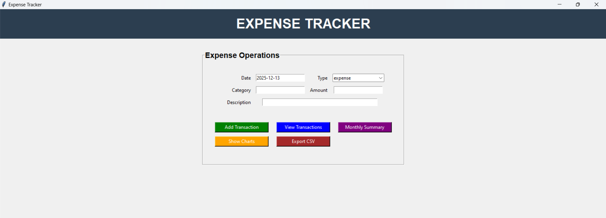
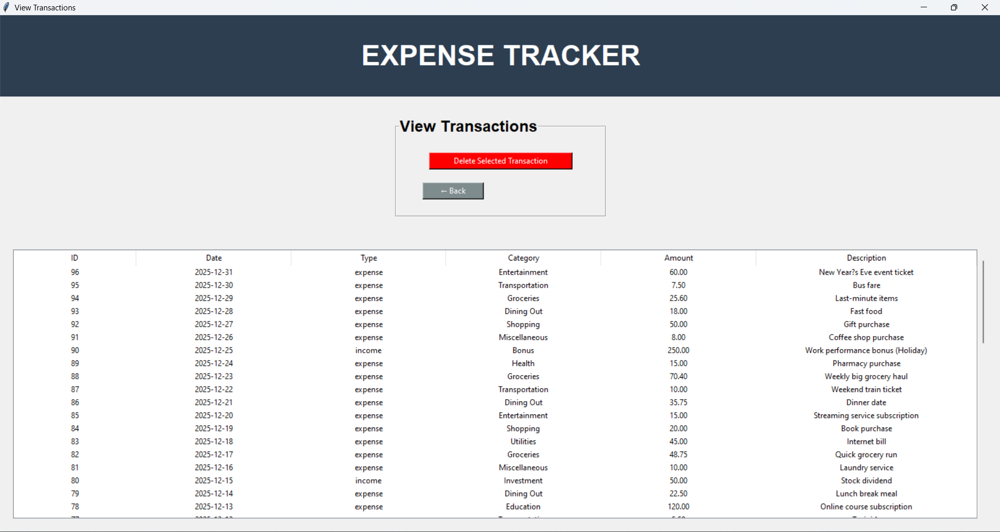
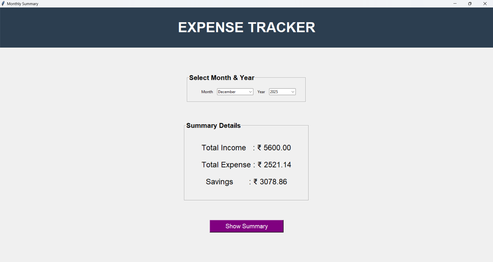
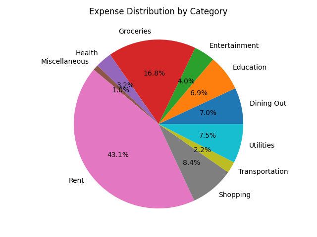

# Personal Finance Tracker in Python ( Tkinter Frontend & MySQL Backend )

A desktop-based **Personal Finance Tracker** built using **Python**, **Tkinter**, **MySQL**, and **Matplotlib**. 
This application provides a simple and user-friendly GUI to manage income, expenses, monthly summaries, and financial insights with visual charts.

---

## Frontend
Tkinter-based graphical user interface for easy interaction and data entry.

## Database
MySQL is used as the backend database to store all transaction details securely.

---

## Features

### Transaction Management
- Add Transaction: Add income or expense entries with date, category, amount, and description.
- Delete Transaction: Remove selected transactions from the database.
- View Transactions: Display all stored transactions in a tabular format.
- Input Validation: Ensures correct date format, positive amount, and non-empty fields.

### Financial Analytics
- Monthly Summary:
  - Total Income
  - Total Expenses
  - Savings calculation
- Automatic filtering by selected month and year.

### Data Visualization
- Monthly Expense Bar Chart
- Category-wise Expense Pie Chart
- Expense Trend Line Chart over time

### Data Export
- Export all transactions to a CSV file for external analysis or record keeping.

---

## Screenshots

### Main Interface


### Transactions – View


### Summary - Details


### Charts - Pie_Chart

---

## Setup

### 1. Fork this repository
Click the **Fork** button on GitHub.

---

### 2. Clone the repository
```bash
git clone https://github.com/pranay-surya/Personal-Finance-Tracker.git
```
## Configure Database
 ```python
DB_HOST = "localhost"
DB_USER = "root"
DB_PASSWORD = "YOUR_DATABASE_PASSWORD"
DB_NAME = "expense_tracker"
```

### Install requirements
```bash
 pip install -r requirements.txt
```
## Run main.py
```bash
 python main.py
```
